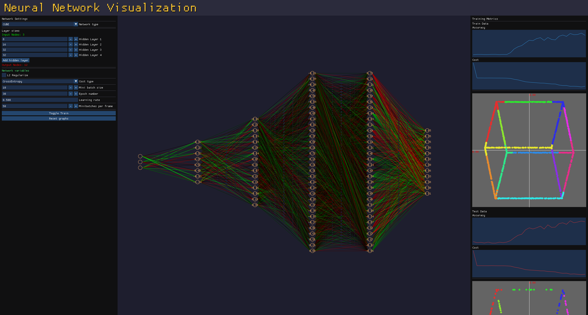

# NeuralNetwork

---

App to visualize a neural network learn, made in cpp using Eigen for faster calculations and SDL + ImGui for graphics.

---

### Features:

- Real-Time Visualization: Watch as the neural network learns over time.
- Interactive Interface: Adjust parameters like learning rate, number of layers, and neurons per layer.
- Multiple Datasets: Choose between different datasets.
- Cost Function Tracking: Monitor the cost function's progression during training.

---

### Quick guide:

If you have never touched a neural network, dont worry, the GUI is pretty simple. One of the most important hyperparameters for you is probably "epoch number". You might
have noticed how your network stopped learning after no time. Its because it went through the specified epochs. I suggest setting this number really high, and just stopping
the training once you are satisfied with your network. Feel free to play around with the other hyperparameters, do note the network might need a reset (Just change a layer size!)
on the change of some hyperparameters, as they could break the current network.

